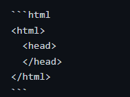
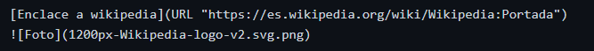
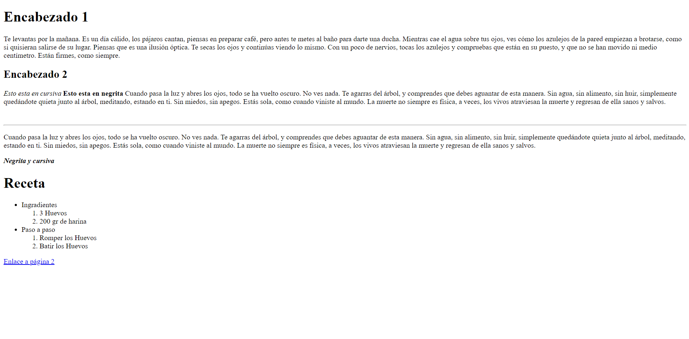

# M4UF1A3_documentacionMP4UF1_apuntes_manavSharma

# Apuntes GitHub

## Creación de un repositorio en GITHUB

Primero de todo accedemos a la página de [Github](URL "https://github.com/")
Después de crear e iniciar sesión en una cuenta, en el menu principal nos aparecerá un apartado dónde se puedan crear nuevos repositorios:


Dándole click nos llevará a crear nuestro repositorio:


Nos aparecerá diferentes apartados:

1. Repository name --> El nombre del repositorio que deseamos darle.
2. Description --> Una breve descripción sobre nuestro repositorio y las actualizaciones que vayamos insertando.
3. Podemos ponerlo tanto público "public" como en privado "private".
4. ¡IMPORTANTE! --> Crear un archivo read.me para que podamos gestionar de manera correcta nuestro repositorio y que no tengamos ningún problema.

Una vez creado el repositorio podemos interactuar con él añadiendo archivos o configurando documentos desde la propia usando el lenguaje de MarkDOWN.

Lista de comandos de MarkDOWN:

## Para crear encabezados:


### Resultado:

# Encabezado 1 (h1)
## Encabezado 2 (h2)
### Encabezado 3 (h3)
###### Encabezado 6 (h6)

## Para crear textos según cursiva-negrita:


### Resultado:

*Este texto aparece en cursiva*

_Este texto aparece en cirsuiva_

**Este texto aparece en negrita**

_**Este texto aparece en negrita y en cursiva**_

__Este texto aparece en negrita__

## Para crear listas no-ordenadas/ordenadas:


### Resultado:

Lista ordenada:
1. Titulo1
2. Titulo2

Lista ordenada con subtítulos:
1. Titulo1
    1. Subtitulo1
    2. Subtitulo2
    3. Subtitulo3
2. Titulo2

Lista desordenada:

* Titulo1
- Titulo2
+ Titulo3

## Para crear una secuencia de códigos HTML y poder copiarlos:



### Resultado:

```html
<html>
  <head>
  </head> 
</html>
```

## Para poner links o fotos:



### Resultado:

[Enclace a wikipedia](URL "https://es.wikipedia.org/wiki/Wikipedia:Portada")


## Para crear tablas:


### Resultado:

| Encabezado 1 | Encabezado 2 | Encabezado 3 |
| ------------ | :----------: | -----------: |
| Item1        | Boligrafos   | 20 euros     |
| Item2        | Lavadora     | 1000 euros   |
| Item3        | Lapices      | 50 euros     |


# GitHUB y CMD:

# HTML:

**HTML** és un lenguaje de marcas que se utiliza para estructurar y desplegar una página web y sus contenidos.
En nuestro caso para utilizar html descargaremos [VISUAL STUDIO CODE](URL "https://code.visualstudio.com/"), un editor de codigo fuente que nos dejará interactuar con HTML.

## BÁSICO HTML:

```html

<!DOCTYPE html>                                                             <!-- Tipo de documento que va a ser -->
<html lang="es">                                                            <!-- A partir de aquí es todo html (lang = "es") Atributo de la etiqueta -->
<head>
    <meta charset="UTF-8">                                                  <!-- "UFT-8" Tiene "ñ", "ç", "accentos", etc. -->                                                       
    <meta http-equiv="X-UA-Compatible" content="IE=edge">                           
    <meta name="viewport" content="width=device-width, initial-scale=1.0">
    <title>Mi página web</title>
</head>
<h1>Encabezado 1</h1>
<div>
<body>
    <!-- Mi primer párrafo -->
    <p id="pararafo1" class="Informacion" style="CSS" title="Info"> Te levantas por la mañana. Es un día cálido, los pájaros cantan, piensas en preparar café, pero antes te metes al baño para darte una ducha. Mientras cae el agua sobre tus ojos, ves cómo los azulejos de la pared empiezan a brotarse, como si quisieran salirse de su lugar. Piensas que es una ilusión óptica. Te secas los ojos y continúas viendo lo mismo. Con un poco de nervios, tocas los azulejos y compruebas que están en su puesto, y que no se han movido ni medio centímetro. Están firmes, como siempre. </p>
    <h2>Encabezado 2</h2>
    <p><em> Esto esta en cursiva </em> <!-- cursiva --> <strong> Esto esta en negrita </strong> <!-- Negrita --> Cuando pasa la luz y abres los ojos, todo se ha vuelto oscuro. No ves nada. Te agarras del árbol, y comprendes que debes aguantar de esta manera. Sin agua, sin alimento, sin huir, simplemente quedándote quieta junto al árbol, meditando, estando en ti. Sin miedos, sin apegos. Estás sola, como cuando viniste al mundo. La muerte no siempre es física, a veces, los vivos atraviesan la muerte y regresan de ella sanos y salvos. </p>
    <br> <!-- Salto de línia -->
    <hr> <!-- Salto de línia con una línia visible -->
    <p>Cuando pasa la luz y abres los ojos, todo se ha vuelto oscuro. No ves nada. Te agarras del árbol, y comprendes que debes aguantar de esta manera. Sin agua, sin alimento, sin huir, simplemente quedándote quieta junto al árbol, meditando, estando en ti. Sin miedos, sin apegos. Estás sola, como cuando viniste al mundo. La muerte no siempre es física, a veces, los vivos atraviesan la muerte y regresan de ella sanos y salvos. </p>
    <strong><em>Negrita y cursiva</em></strong> 
</div>

<div>
    <h1>Receta</h1>
    <ul>
        <li>Ingradientes</li>
            <ol>
                <Li>3 Huevos</Li>
                <li>200 gr de harina</li> 
            </ol> 
        <Li>Paso a paso</Li>
            <ol>
                <li>Romper los Huevos</li>
                <li>Batir los Huevos</li>
            </ol>
    </ul>
    <a href ="img/videos/home.html">Enlace a página 2</a> <!-- Enlaces... Ir a una carpta: /algo/ALGO... Viceversa: ../ALGO para retroceder a algo. -->
     <!-- Etiqueta especial src: Buscar o definir dónde está ubicada la imagen/ alt: Cuando no se muestra la imágen, aparezca un texto alternativo-->
</div><!-- Definir un bloque --> <!-- IMPORTANTE! -->
</body>

</html><!-- Aquí finaliza el html --> 

```

### RESULTADO:




