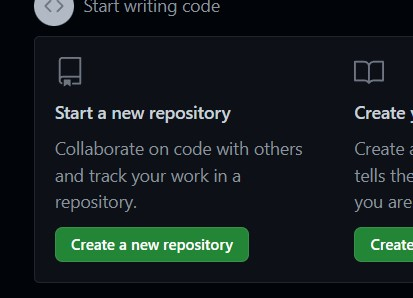
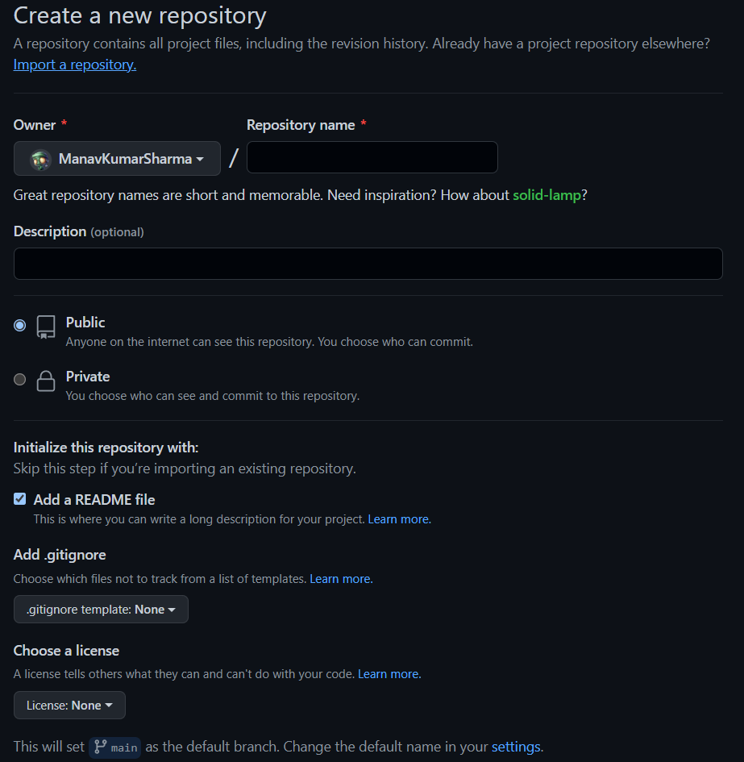
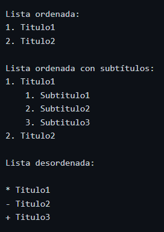

# M4UF1A3_documentacionMP4UF1_apuntes_manavSharma

## Apuntes GitHub

# Creación de un repositorio en GITHUB

Primero de todo accedemos a la página de [Github](URL "https://github.com/")
Después de crear e iniciar sesión en una cuenta, en el menu principal nos aparecerá un apartado dónde se puedan crear nuevos repositorios:

Dándole click nos llevará a crear nuestro repositorio:

Nos aparecerá diferentes apartados:

1. Repository name --> El nombre del repositorio que deseamos darle.
2. Description --> Una breve descripción sobre nuestro repositorio y las actualizaciones que vayamos insertando.
3. Podemos ponerlo tanto público "public" como en privado "private".
4. ¡IMPORTANTE! --> Crear un archivo read.me para que podamos gestionar de manera correcta nuestro repositorio y que no tengamos ningún problema.

Una vez creado el repositorio podemos interactuar con él añadiendo archivos o configurando documentos desde la propia usando el lenguaje de MarkDOWN.

Lista de comandos de MarkDOWN:

## Para crear encabezados:

### Resultado:

# Encabezado 1 (h1)
## Encabezado 2 (h2)
### Encabezado 3 (h3)
###### Encabezado 6 (h6)

## Para crear textos según cursiva-negrita:

### Resultado:

*Este texto aparece en cursiva*

_Este texto aparece en cirsuiva_

**Este texto aparece en negrita**

_**Este texto aparece en negrita y en cursiva**_

__Este texto aparece en negrita__

## Para crear listas no-ordenadas/ordenadas:

### Resultado:

Lista ordenada:
1. Titulo1
2. Titulo2

Lista ordenada con subtítulos:
1. Titulo1
    1. Subtitulo1
    2. Subtitulo2
    3. Subtitulo3
2. Titulo2

Lista desordenada:

* Titulo1
- Titulo2
+ Titulo3

