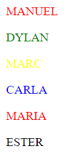

# M4UF1A3_documentacionMP4UF1_apuntes_manavSharma

# Apuntes GitHub

## Creación de un repositorio en GITHUB

Primero de todo accedemos a la página de [Github](URL "https://github.com/")
Después de crear e iniciar sesión en una cuenta, en el menu principal nos aparecerá un apartado dónde se puedan crear nuevos repositorios:


Dándole click nos llevará a crear nuestro repositorio:


Nos aparecerá diferentes apartados:

1. Repository name --> El nombre del repositorio que deseamos darle.
2. Description --> Una breve descripción sobre nuestro repositorio y las actualizaciones que vayamos insertando.
3. Podemos ponerlo tanto público "public" como en privado "private".
4. ¡IMPORTANTE! --> Crear un archivo read.me para que podamos gestionar de manera correcta nuestro repositorio y que no tengamos ningún problema.

Una vez creado el repositorio podemos interactuar con él añadiendo archivos o configurando documentos desde la propia usando el lenguaje de MarkDOWN.

## Lista de comandos de MarkDOWN:

## Para crear encabezados:


### Resultado:

# Encabezado 1 (h1)
## Encabezado 2 (h2)
### Encabezado 3 (h3)
###### Encabezado 6 (h6)

## Para crear textos según cursiva-negrita:


### Resultado:

*Este texto aparece en cursiva*

_Este texto aparece en cirsuiva_

**Este texto aparece en negrita**

_**Este texto aparece en negrita y en cursiva**_

__Este texto aparece en negrita__

## Para crear listas no-ordenadas/ordenadas:


### Resultado:

Lista ordenada:
1. Titulo1
2. Titulo2

Lista ordenada con subtítulos:
1. Titulo1
    1. Subtitulo1
    2. Subtitulo2
    3. Subtitulo3
2. Titulo2

Lista desordenada:

* Titulo1
- Titulo2
+ Titulo3

## Para crear una secuencia de códigos HTML y poder copiarlos:


### Resultado:

```html
<html>
  <head>
  </head> 
</html>
```

## Para poner links o fotos:


### Resultado:

[Enclace a wikipedia](URL "https://es.wikipedia.org/wiki/Wikipedia:Portada")


## Para crear tablas:


### Resultado:

| Encabezado 1 | Encabezado 2 | Encabezado 3 |
| ------------ | :----------: | -----------: |
| Item1        | Boligrafos   | 20 euros     |
| Item2        | Lavadora     | 1000 euros   |
| Item3        | Lapices      | 50 euros     |


# GitHUB y CMD

[GitHub](URL "https://github.com/") es un sitio "social coding" dónde te permite subir repositorios de código para almacenarlo en el sistema de controles [GIT](URL "https://git-scm.com/").


## Utilización de GIT en CMD
Para acceder al CMD debemos ir al **WINDOWS** y escribir CMD que es la ventana de comandos de Windows.


Una vez accedido, nos aparecerá una ventana con el símbolo del sistema.


Tenemos el caso que nos hemos creado un repositorio de prueba llamado _aprendizajeMarkdown_. Nos interesa hacer una copia de este repositorio en nuestro equipo. Primero de todo copiamos la URL del repositorio. Recalcar que anteriormente hemos creado una carpeta llamado _repositorios GIT_ dentro del disco C:.


Una vez copiado el link del repositorio, nos dirigimos al CMD y navegamos por el de la siguiente manera:
### Moverse por CMD por rutas:

cd.. --> Ir una carpeta atrás.

dir --> "Directory" --> Mostrar todo lo que contiene la carpeta.

Mkdir --> Crear una carpeta.

Rd --> Eliminar un archivo.

Cd ./“nombre de la carpeta” --> Entrar en la carpeta directamente si necesidad de pasa una por una.

Una vez sabemos esto, nos interesa ir al disco C:, repositorios GIT y clonar el repositorio que hemos copiado de la siguiente manera:


Hemos llegado al disco C: y procedemos a entrar a _repositorios GIT_ y clonar con el comando _git clone_ que sirve para clonar el repositorio, de esta manera crea una carpeta con todo lo contenido del repositorio.


Para poder subir los archivos que vayamos añadiendo en la carpeta _aprendizajeMarkdown_ a GitHUB debemos primero sincronizar la carpeta con el repositorio.
En este caso hemos añadido un bloc de notas llamado _ArchivoPrueba_.


Para sincronizarlo debemos poner el comando _git init_, después con el comando _git add ArchivoPrueba.txt_ estamos añadiendo el archivo prueba. Una vez añadido el archivo, lo empaquetamos con el comando _git commit -m "descripción"_, en este caso nuestra descripción es "añadir archivo". Empaquetarlo es poner todos los archivos añadidos en un paquete. Por último subimos el archivo con el comando _git push origin main_ que nos subirá el archivo a nuestro repositorio.


Finalmente hemos conseguido añadir un archivo con GIT desde el CMD sincronizando con GitHUB.

# HTML:

**HTML** es un lenguaje de marcas que se utiliza para estructurar y desplegar una página web y sus contenidos.
En nuestro caso para utilizar html descargaremos [VISUAL STUDIO CODE](URL "https://code.visualstudio.com/"), un editor de codigo fuente que nos dejará interactuar con HTML.

## BÁSICO HTML:

```html

<!DOCTYPE html>                                                             <!-- Tipo de documento que va a ser -->
<html lang="es">                                                            <!-- A partir de aquí es todo html (lang = "es") Atributo de la etiqueta -->
<head>
    <meta charset="UTF-8">                                                  <!-- "UFT-8" Tiene "ñ", "ç", "accentos", etc. -->                                                       
    <meta http-equiv="X-UA-Compatible" content="IE=edge">                           
    <meta name="viewport" content="width=device-width, initial-scale=1.0">
    <title>Mi página web</title>
</head>
<h1>Encabezado 1</h1>
<div>
<body>
    <!-- Mi primer párrafo -->
    <p id="pararafo1" class="Informacion" style="CSS" title="Info"> Te levantas por la mañana. Es un día cálido, los pájaros cantan, piensas en preparar café, pero antes te metes al baño para darte una ducha. Mientras cae el agua sobre tus ojos, ves cómo los azulejos de la pared empiezan a brotarse, como si quisieran salirse de su lugar. Piensas que es una ilusión óptica. Te secas los ojos y continúas viendo lo mismo. Con un poco de nervios, tocas los azulejos y compruebas que están en su puesto, y que no se han movido ni medio centímetro. Están firmes, como siempre. </p>
    <h2>Encabezado 2</h2>
    <p><em> Esto esta en cursiva </em> <!-- cursiva --> <strong> Esto esta en negrita </strong> <!-- Negrita --> Cuando pasa la luz y abres los ojos, todo se ha vuelto oscuro. No ves nada. Te agarras del árbol, y comprendes que debes aguantar de esta manera. Sin agua, sin alimento, sin huir, simplemente quedándote quieta junto al árbol, meditando, estando en ti. Sin miedos, sin apegos. Estás sola, como cuando viniste al mundo. La muerte no siempre es física, a veces, los vivos atraviesan la muerte y regresan de ella sanos y salvos. </p>
    <br> <!-- Salto de línia -->
    <hr> <!-- Salto de línia con una línia visible -->
    <p>Cuando pasa la luz y abres los ojos, todo se ha vuelto oscuro. No ves nada. Te agarras del árbol, y comprendes que debes aguantar de esta manera. Sin agua, sin alimento, sin huir, simplemente quedándote quieta junto al árbol, meditando, estando en ti. Sin miedos, sin apegos. Estás sola, como cuando viniste al mundo. La muerte no siempre es física, a veces, los vivos atraviesan la muerte y regresan de ella sanos y salvos. </p>
    <strong><em>Negrita y cursiva</em></strong> 
</div>

<div>
    <h1>Receta</h1>
    <ul>
        <li>Ingradientes</li>
            <ol>
                <Li>3 Huevos</Li>
                <li>200 gr de harina</li> 
            </ol> 
        <Li>Paso a paso</Li>
            <ol>
                <li>Romper los Huevos</li>
                <li>Batir los Huevos</li>
            </ol>
    </ul>
    <a href ="img/videos/home.html">Enlace a página 2</a> <!-- Enlaces... Ir a una carpta: /algo/ALGO... Viceversa: ../ALGO para retroceder a algo. -->
     <!-- Etiqueta especial src: Buscar o definir dónde está ubicada la imagen/ alt: Cuando no se muestra la imágen, aparezca un texto alternativo-->
</div><!-- Definir un bloque --> <!-- IMPORTANTE! -->
</body>

</html><!-- Aquí finaliza el html --> 

```

### RESULTADO:


# APUNTES CSS

Es un lenguaje de marcas que se utiliza para dar estilo a la página y va junto a un documento HTML. Hay dos maneras de atacar:
1. Desde las etiquetas en el documento html, por ejemplo: \<p (nombre_atributo_característica_valor)>\</p>. Esto hará que solamente la etiqueta modificada se verá afectada y no las demás (También es conocido como selector elemento).
```html
<p style="color:red;">HOLA BUENOS DÍAS</p>
<p>HOLA BUENOS DÍAS</p>
```


2. De manera global:
    1. Por el encabezado (```head```):
```html
<!DOCTYPE html>
<html lang="en">
<head>
    <meta charset="UTF-8">
    <meta http-equiv="X-UA-Compatible" content="IE=edge">
    <meta name="viewport" content="width=device-width, initial-scale=1.0">
    <title>Document</title>
    <style>
        p {
            color: red;
        }
    </style>
</head>
<body>
<p>HOLA BUENAS NOCHES</p>
<P>HOLA BUENAS TARDES</P>
<P>HOLA BUENOS DÍAS</P>
</body>
</html>

```


   ii. Por una hoja de estilos externa:
```html
    <link rel="stylesheet" href="estilo.css">
```


Añadiendo este código al ```head``` del documento html, lo que hacemos es vincularlo a un documento de hoja de estilos externa que finalice con la extension ".css".
Tanto como crear el ```style``` en el encabezado como en una hoja de estilos externa, harán la misma función, afectar de manera global a todas los selectores a **excepción** de aquellas que han sido modificadas desde la etiqueta.

```html
<!DOCTYPE html>
<html lang="en">
<head>
    <meta charset="UTF-8">
    <meta http-equiv="X-UA-Compatible" content="IE=edge">
    <meta name="viewport" content="width=device-width, initial-scale=1.0">
    <title>Document</title>
    <link rel="stylesheet" href="estilo.css">´
    <style>
        p  {
            color: blue;
        }
    </style>
</head>
<body>
<p>HOLA BUENAS NOCHES</p>
<P>HOLA BUENAS TARDES</P>
<P style="color:red ;">HOLA BUENOS DÍAS</P>
</body>
</html>
```


## IDENTIFICADORES
Los identificadores son selectores que su función es identificar elementos del documento HTML y modificarlos por separado para que no afecten a otras etiquetas. 
Existen dos tipos de identificadores.
1. Identificador ```id```: Es representada en la hoja de estilos con una ```#```
2. Identificador ```class```: Es representada en la hoja de estilos con un ```.```
3. Identificador de ```elementos```: Lo hemos hablado anteriormente, permite modificar el estilo dentro de las etiquetas.
#### EJEMPLO

```html
<!DOCTYPE html>
<html lang="en">
<head>
    <meta charset="UTF-8">
    <meta http-equiv="X-UA-Compatible" content="IE=edge">
    <meta name="viewport" content="width=device-width, initial-scale=1.0">
    <title>Document</title>
    <link rel="stylesheet" href="estilo.css">´
    <style>
        #IDENTIFICADOR_1 {
            color: red;
        }

        #IDENTIFICADOR_2 {
            color: green;
        }

        .IDENTIFICADOR_3 {
            color: yellow;
        }

        .IDENTIFICADOR_4 {
            color: blue;
        }
    </style>
</head>
<body>
<p id="IDENTIFICADOR_1">MANUEL</p>
<p id="IDENTIFICADOR_2">DYLAN</p>
<p class="IDENTIFICADOR_3">MARC</p>
<p class="IDENTIFICADOR_4">CARLA</p>
<p id="IDENTIFICADOR_1">MARIA</p>
<P>ESTER</P>

</body>
</html>

```



En este caso vemos como los identificadores afectan de manera global aquellos que lleven el mismo atributo y nombre (como en el ```IDENTIFICADOR_1``` que afecta a todos los ```IDENTIFICADOR_1``` que lleven una id) y no afectan en aquellas que no llevan aquel identificador como en el caso de ```<p>ESTER</p>```.

En el caso que modifiquemos de manera global el documento con ```*```, los identificadores tendrán prioridad.

```html
<!DOCTYPE html>
<html lang="en">
<head>
    <meta charset="UTF-8">
    <meta http-equiv="X-UA-Compatible" content="IE=edge">
    <meta name="viewport" content="width=device-width, initial-scale=1.0">
    <title>Document</title>
    <link rel="stylesheet" href="estilo.css">´
    <style>
    * {
        color: aqua;
    }

    .IDENTIFICADOR_2 {
        color: blue;
    }

    #IDENTIFICADOR_1 {
        color: brown;
    }
    
    </style>
</head>
<body>
<p id="IDENTIFICADOR_1">MANUEL</p>
<p id="IDENTIFICADOR_1">DYLAN</p>
<p class="IDENTIFICADOR_2">MARC</p>
<p class="IDENTIFICADOR_2">CARLA</p>
<p>MARIA</p>
<P>ESTER</P>
<P>ALBERTO</P>

</body>
</html>

```


Si ponemos una "," separa los selectores y les afecta por igual.

```html
<!DOCTYPE html>
<html lang="en">
<head>
    <meta charset="UTF-8">
    <meta http-equiv="X-UA-Compatible" content="IE=edge">
    <meta name="viewport" content="width=device-width, initial-scale=1.0">
    <title>Document</title>
    <link rel="stylesheet" href="estilo.css">´
    <style>
    * {
        color: aqua;
    }

    .IDENTIFICADOR_2, #IDENTIFICADOR_1 {
        color: blue;
    }


    
    </style>
</head>
<body>
<p id="IDENTIFICADOR_1">MANUEL</p>
<p id="IDENTIFICADOR_1">DYLAN</p>
<p class="IDENTIFICADOR_2">MARC</p>
<p class="IDENTIFICADOR_2">CARLA</p>
<p>MARIA</p>
<P>ESTER</P>
<P>ALBERTO</P>

</body>
</html>
```


#### SELECTORES AVANZADOS
1. Selector universal ```*```: Sirve para seleccionar todos los elementos de la página. Ejemplo:

```html
<!DOCTYPE html>
<html lang="en">
<head>
    <meta charset="UTF-8">
    <meta http-equiv="X-UA-Compatible" content="IE=edge">
    <meta name="viewport" content="width=device-width, initial-scale=1.0">
    <title>Document</title>
    <link rel="stylesheet" href="estilo.css">´
    <style>
  
    * {
        color: red;
    }
    
    </style>
</head>
<body>
<p id="IDENTIFICADOR_1">MANUEL</p>
<p id="IDENTIFICADOR_1">DYLAN</p>
<p class="IDENTIFICADOR_2">MARC</p>
<p class="IDENTIFICADOR_2">CARLA</p>
<p>MARIA</p>
<P>ESTER</P>
<P>ALBERTO</P>

</body>
</html>
```


2. Selectores de atributos: Selecciona elementos en función de los atributos que tienen. Ejemplo:

```html
<!DOCTYPE html>
<html lang="en">
<head>
    <meta charset="UTF-8">
    <meta http-equiv="X-UA-Compatible" content="IE=edge">
    <meta name="viewport" content="width=device-width, initial-scale=1.0">
    <title>Document</title>
    <link rel="stylesheet" href="estilo.css">
    <style>
  a[href] {
    color: green;
  }
  
    </style>
</head>
<body>

<a href="google.com">google</a>
</body>
</html>
```


3. Selectores de hijos: Aquellos que son hijos directos de otros elementos. Es decir, es cuando tenemos un elemento 'a' que adentro tiene hijos y su hijo se llama 'b'. Entonces dependen directamente. Si este elemento 'b', a su vez, tiene hijos 'c', no puede depender del primer elemento. Ejemplo:

```html
<!DOCTYPE html>
<html lang="en">
<head>
    <meta charset="UTF-8">
    <meta http-equiv="X-UA-Compatible" content="IE=edge">
    <meta name="viewport" content="width=device-width, initial-scale=1.0">
    <title>Document</title>
    <link rel="stylesheet" href="estilo.css">
    <style>
  
        div > p {
            color:red ;
        }
    </style>
</head>
<body>

    <div>
        <p>que tal</p>
        <ol>
            <li>goodbye</li>
            <li>Adios</li>
            <p>hola</p>
        </ol>

    </div>

</body>
</html>
```


4. Selector de descendientes: A diferencia de los selectores hijos, este afecta directamente a toda la jerarquía. Ejemplo:

```html
<!DOCTYPE html>
<html lang="en">
<head>
    <meta charset="UTF-8">
    <meta http-equiv="X-UA-Compatible" content="IE=edge">
    <meta name="viewport" content="width=device-width, initial-scale=1.0">
    <title>Document</title>
    <link rel="stylesheet" href="estilo.css">
    <style>
  
        div  p {
            color:red ;
        }
    </style>
</head>
<body>

    <div>
        <p>que tal</p>
        <ol>
            <li>goodbye</li>
            <li>Adios</li>
            <p>hola</p>
        </ol>

    </div>

</body>
</html>
```


5. Selector de hermanos adyacentes: Afecta a aquellos elementos que estén al mismo nivel de la jerarquía. El "+" es para quellos afectados solamente entre dos etiquetas, sin afectar a los demás que sean de la misma.

```html
<!DOCTYPE html>
<html lang="en">
<head>
    <meta charset="UTF-8">
    <meta http-equiv="X-UA-Compatible" content="IE=edge">
    <meta name="viewport" content="width=device-width, initial-scale=1.0">
    <title>Document</title>
    <link rel="stylesheet" href="estilo.css">
    <style>
        h1+h2 {
            color: blue;
        }


    </style>
</head>
<body>
    <h1>HOLA</h1>
    <h2>ADIÓS</h2>
    <h1>HELLO</h1>
    <h3>GOODBYE</h3>
    <h2>google</h2>


</body>
</html>
````


6. Pseudoclass: Una pseudoclase es un selector que marca los elementos que están en un estado específico, por ejemplo, los que son el primer elemento de su tipo, o aquellos por los que el cursor les pasa por encima. 
Hay diversos casos:
* :Link: El estado normal por defecto de los enlaces. Tal y como se ven por primera vez.
* :visited: Enlaces que ya se han visitado con el navegador que se está utilizando.
* :focus: Enlaces (o campos de formularios, o cualquier otra cosa) que tienen en ese momento el cursor en su interior.
* :hover: Enlaces que tienen en este momento el puntero del ratón sobre ellos.

7. Pseudoelemento: Permiten añadir estilos en una parte en concreta del documento. Ejemplo:

```html
<!DOCTYPE html>
<html lang="en">
<head>
    <meta charset="UTF-8">
    <meta http-equiv="X-UA-Compatible" content="IE=edge">
    <meta name="viewport" content="width=device-width, initial-scale=1.0">
    <title>Document</title>
    <link rel="stylesheet" href="estilo.css">
    <style>
        p::first-line {
            color:green ;
        }

    </style>
</head>
<body>
 
    <p>HOLAAAAAAAAAAAAAAAAAAAAAAAAAAAAAAAAAAAAAAAAAAAAAAAAAAAAAAAAAAAAAAAAAAAAAAAAAAAAAAAAAAAAAAAAAAAAAAAAAAAAAAAAAAAAAAAAAAAAAAAAAAAAAAAAAAAAAAAAAAAAAAAAAAAAAAAAAAAAAAAAAAAAAAAAAAAAAAAAAAAAAA
        ADIOOOOOOOOOOOOOOOOOOOOOOOOOOOOOOOS
    </p>

</body>
</html>

```
Afectará únicamente a la primera línia de la *página web*.


### COMPOSICIÓN
* Margin es para darle margen tiene margin-(top)(left)(right)(bottom) px, cm, %.
```html
<!DOCTYPE html>
<html lang="en">
<head>
    <meta charset="UTF-8">
    <meta http-equiv="X-UA-Compatible" content="IE=edge">
    <meta name="viewport" content="width=device-width, initial-scale=1.0">
    <title>Document</title>
    <link rel="stylesheet" href="estilo.css">
    <style>
        h1{
            margin-top: 50px;
        }

    </style>
</head>
<body>
 
    <h1>HOLA</h1>
</body>
</html>
```


* Border, es un contenedor y es la línia que define donde se separa el div tiene border-(top)(left)(right)(bottom).

```html
<!DOCTYPE html>
<html lang="en">
<head>
    <meta charset="UTF-8">
    <meta http-equiv="X-UA-Compatible" content="IE=edge">
    <meta name="viewport" content="width=device-width, initial-scale=1.0">
    <title>Document</title>
    <link rel="stylesheet" href="estilo.css">
    <style>
       
        div {
            border: solid red;
        }

    </style>
</head>
<body>
    <div>
        <h1>HOLA</h1>
    </div>
    
</body>
</html>

```


* Padding, la separación entre una etiqueta y el elemento div.

```html
<!DOCTYPE html>
<html lang="en">
<head>
    <meta charset="UTF-8">
    <meta http-equiv="X-UA-Compatible" content="IE=edge">
    <meta name="viewport" content="width=device-width, initial-scale=1.0">
    <title>Document</title>
    <link rel="stylesheet" href="estilo.css">
    <style>
        h1{
            padding: 20px;
            
        }

        div {
            border: solid red;
        }

    </style>
</head>
<body>
    <div>
        <h1>HOLA</h1>
    </div>
    
</body>
</html>
```


### GOOGLE FONTS

Gracias a [Google Fonts](URL "https://fonts.google.com/") podemos modificar la fuente de letra.

1. Entramos a la página web y seleccionamos el tipo de fuente que deseamos:


2. eL primer link sirve para colocarlo en el head del documento HTML. El segundo para colocarlo a una hoja de estilos externa.


En caso de que usemos el código en el head del html:

```html
<!DOCTYPE html>
<html lang="en">
<head>
    <meta charset="UTF-8">
    <meta http-equiv="X-UA-Compatible" content="IE=edge">
    <meta name="viewport" content="width=device-width, initial-scale=1.0">
    <title>Document</title>
    <link rel="stylesheet" href="estilo.css">
    <link rel="preconnect" href="https://fonts.googleapis.com">
    <link rel="preconnect" href="https://fonts.gstatic.com" crossorigin>
    <link href="https://fonts.googleapis.com/css2?family=Roboto:wght@100&display=swap" rel="stylesheet">
    <style>
        h1{
            padding: 50px;
            font-family: 'Roboto', sans-serif;
        }

    </style>
</head>
<body>
    <div>
        <h1>HOLA MI NOMBRE ES MANU</h1>
    </div>
    
</body>
</html>
```


En caso que usemos el código en una hoja de estilos externa:

```css

@import url('https://fonts.googleapis.com/css2?family=Roboto:wght@100&display=swap');

h1 {
    font-family: 'Roboto', sans-serif;
}

```


